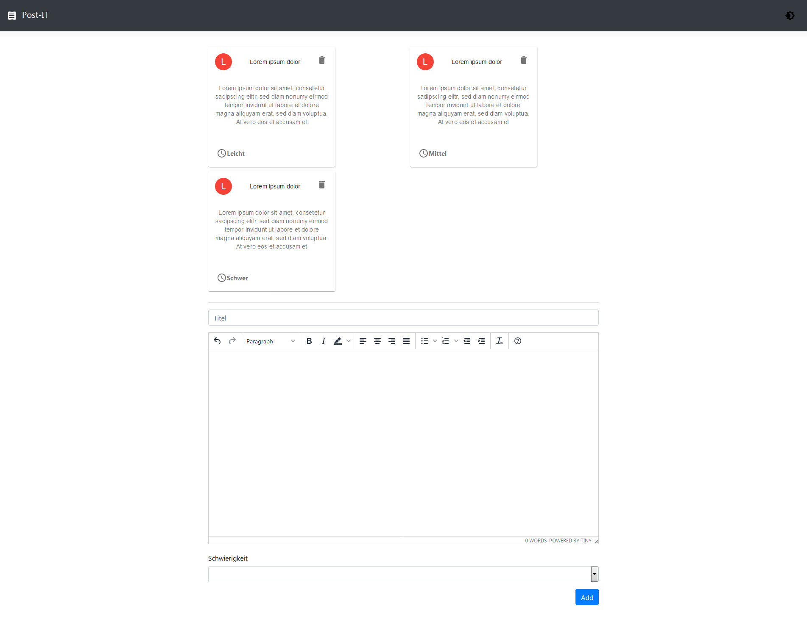

# App

  

# Intro

React Anwendung für das erstellen von Post-Its.

  

# Sprachen

Das Projekt wurde mithilfe folgender Sprachen realisiert:
 

- JavaScript
- JSX

# Designpattern

- Functional Component

# Bibliotheken

 
 * React
 * Redux (Statemanagement)
